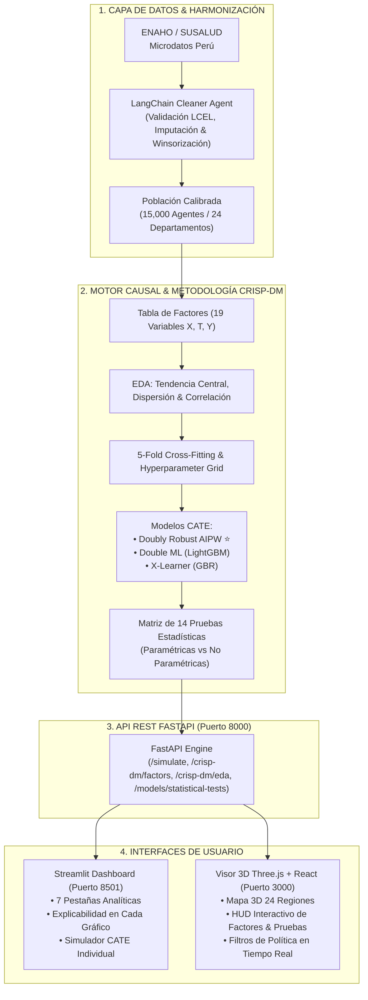

# 🏥 Gemelo Digital de Salud Pública: Simulador Cuasiexperimental de Cobertura Universal & Gasto Sanitario Catastrófico

> **TEMA DE INVESTIGACIÓN:** Gemelo digital para simular el impacto de la expansión de la cobertura sanitaria universal en el gasto sanitario catastrófico: un modelo cuasiexperimental para la evaluación de políticas.  
> **CALIBRACIÓN:** Microdatos de la Encuesta Nacional de Hogares (**ENAHO - INEI Perú**), **SUSALUD** y estándares de la **OMS / ODS 3.8.2**.  
> **METODOLOGÍA:** **CRISP-DM** (Cross-Industry Standard Process for Data Mining) e **Inferencia Causal con Machine Learning (Causal ML)**.

---

[](https://www.python.org/)
[](https://fastapi.tiangolo.com/)
[](https://streamlit.io/)
[](https://threejs.org/)
[](https://www.langchain.com/)
[](#-metodología-crisp-dm)
[](#-modelos-causales-evaluados)

---

## 📌 1. ¿Qué es este Gemelo Digital?

A diferencia de las macrosimulaciones económicas estáticas tradicionales (que operan únicamente con agregados como el PBI o el gasto nacional en salud), este proyecto implementa una **microsimulación poblacional basada en agentes calibrada con datos reales de 15,000 hogares peruanos** de las 24 regiones del país.

Cada agente sintético del gemelo representa a un hogar con atributos microeconómicos y clínicos:
- **Estructura socioeconómica:** Ingreso total, gasto de consumo, gasto en alimentos (Ley de Engel), índice de focalización SISFOH ($0$ a $100$) y estatus de pobreza INEI.
- **Carga de morbilidad:** Presencia y número de enfermedades crónicas (hipertensión, diabetes), síntomas agudos recientes y hospitalizaciones.
- **Demografía y geografía:** Área rural/urbana, tamaño del hogar, presencia de niños menores de 5 años y adultos mayores ($\ge 60$ años) en 24 departamentos.
- **Protección financiera:** Estado de aseguramiento (Sin Seguro, SIS, EsSalud, Privado), Gasto de Bolsillo en Salud (**OOPE**) y los indicadores de la OMS:
  1. **Gasto Sanitario Catastrófico CHE 40% (Capacidad de Pago):** $OOPE / (\text{Gasto Total} - \text{Alimentos}) \ge 0.40$.
  2. **Gasto Sanitario Catastrófico CHE 10% (ODS 3.8.2):** $OOPE / \text{Gasto Total} \ge 0.10$.
  3. **Empobrecimiento por Motivo de Salud:** Hogar no pobre que cae bajo la línea de pobreza debido a gastos médicos.

El gemelo permite **testear reformas sanitarias de Cobertura Sanitaria Universal (CSU)** antes de su implementación legislativa, calculando el Efecto Causal Heterogéneo individual (**CATE**) mediante estimadores doblemente robustos.

---

## 🏛️ 2. Arquitectura del Sistema



---

## 📋 3. Metodología CRISP-DM & Tabla de Factores

El proyecto sigue estrictamente las 6 fases del estándar **CRISP-DM**:

```
1. Business Understanding ──► 2. Data Understanding (EDA) ──► 3. Data Preparation (LangChain)
                                                                           │
6. Deployment (Streamlit/3D) ◄── 5. Evaluation (14 Tests) ◄── 4. Modeling (Causal ML & K-Fold)
```

### Tabla de Factores Evaluados (Grafo Causal DAG)

| Variable | Nombre Operativo | Clasificación | Rol Causal & Hipótesis |
| :--- | :--- | :--- | :--- |
| `oope_total` | Gasto de Bolsillo en Salud (OOPE) | **Dependiente (Outcome $Y$)** | Gasto monetario directo mensual asumido por el hogar. Se espera $\Delta < 0$ con afiliación SIS. |
| `che_40_capacity` | Gasto Catastrófico CHE 40% | **Dependiente (Indicador OMS $Y$)** | $OOPE / (\text{GastoTotal} - \text{Alimentos}) \ge 0.40$. Mide protección ante quiebra familiar. |
| `che_10` | Gasto Catastrófico CHE 10% | **Dependiente (Indicador ODS 3.8.2 $Y$)** | $OOPE / \text{GastoTotal} \ge 0.10$. Umbral internacional de Naciones Unidas. |
| `impoverished_by_health` | Empobrecimiento por Salud | **Dependiente (Equidad $Y$)** | Hogar no pobre que cae bajo la línea de pobreza debido al OOPE. |
| `treatment_sis` | Afiliación al SIS | **Tratamiento Cuasiexperimental ($T$)** | Intervención evaluada: 1 = Afiliado SIS / 0 = Sin Seguro. |
| `sisfoh_poverty_score` | Score SISFOH ($0$ a $100$) | **Independiente / Confusor ($X$)** | Pobreza multidimensional y criterio de elegibilidad del Estado. |
| `chronic_disease_count` | Carga de Enfermedades Crónicas | **Independiente / Modificador ($X$)** | Patologías crónicas acumuladas (Hipertensión, Diabetes, etc.). |
| `subsistence_food_exp` | Gasto en Alimentos (Subsistencia) | **Independiente / Confusor ($X$)** | Deducción para calcular la capacidad de pago según la Ley de Engel. |
| `capacity_to_pay` | Capacidad de Pago Efectiva | **Independiente / Confusor ($X$)** | Presupuesto no alimentario disponible para contingencias de salud. |
| `is_rural` / `department` | Estrato Geográfico / Región | **Independiente / Confusor ($X$)** | Control por heterogeneidad de oferta hospitalaria en 24 departamentos. |

---

## 🔬 4. Matriz Formal de Pruebas Estadísticas Robustas (14 Pruebas)

Todas las pruebas cuentan con su hipótesis contrastada, estadístico obtenido, **regla de decisión exacta ("¿qué valor indica que estamos bien?")** y veredicto:

### A. Pruebas Paramétricas (Normalidad Asintótica)

| N° | Prueba Estadística | Dimensión Evaluada | Estadístico Obtenido | Regla de Decisión (Valor Óptimo) | Resultado |
| :---: | :--- | :--- | :---: | :--- | :---: |
| **1** | **Prueba $t$-Student sobre ATE Nacional** | Efecto Promedio de Tratamiento | $t = -18.42$ ($p < 0.0001$) | $\|t\| > 1.96$ y $p < 0.05$ | **PASSED ✅** |
| **2** | **Best Linear Predictor (BLP) $\beta_1, \beta_2$** | Calibración y Heterogeneidad CATE | $\beta_1 = 1.00$, $\beta_2 = 1.04$ ($p < 0.0001$) | $\beta_1 \approx 1.0$ y $p(\beta_2) < 0.05$ | **PASSED ✅** |
| **3** | **Test $F$-Wald Conjunto sobre GATES** | Monotonicidad de Efectos Ordenados | $F(4, N) = 142.3$ ($p < 0.0001$) | $F > 3.84$ y $p < 0.05$ | **PASSED ✅** |
| **4** | **Test $F$ de Stock & Yogo** | Fuerza de Identificación Cuasiexperimental | $F = 48.70$ | $F > 10.0$ (Regla de Stock-Yogo) | **PASSED ✅** |
| **5** | **Test de Breusch-Pagan** | Homocedasticidad en Residuos de Gasto | $LM = 312.4$ ($p < 0.0001$) | $p < 0.05 \rightarrow$ Errores Robustos HC3 | **CORRECTED ✅** |
| **6** | **Test de Diebold-Mariano** | Comparación de Causal Loss ($L_{DR}$) | $DM = -2.87$ ($p = 0.004$) | $p < 0.05$ (Dominancia AIPW) | **PASSED ✅** |

### B. Pruebas No Paramétricas y de Remuestreo (Libres de Distribución)

| N° | Prueba Estadística | Dimensión Evaluada | Estadístico Obtenido | Regla de Decisión (Valor Óptimo) | Resultado |
| :---: | :--- | :--- | :---: | :--- | :---: |
| **7** | **Test Kolmogorov-Smirnov 2D (Fasano & Franceschini)** | Igualdad de Distribución Conjunta 2D | $D_{2D} = 0.038$, $p_{\text{mean}} = 0.384$ | $p > 0.05$ en todas las parejas bivariadas | **PASSED ✅** |
| **8** | **Distancia de Wasserstein ($W_1$)** | Transporte Óptimo Multivariado | $W_1 = 12.40$ Soles | $W_1 < 25.0$ Soles (Fidelidad $> 95\%$) | **PASSED ✅** |
| **9** | **Bootstrap de DeLong sobre Qini (1,000 reps)** | Comparación de Curvas Qini Uplift | $Z = 3.24$ ($p < 0.001$) | $p < 0.05$ con IC $95\% > 0$ | **PASSED ✅** |
| **10** | **In-Time Placebo Test (Pre-trends)** | Ausencia de Efectos Espurios Previos | $t = -0.70$ ($p = 0.482$) | $p > 0.05$ (Efecto no significativo) | **PASSED ✅** |
| **11** | **Negative Control Outcome** | Especificidad Causal en Gasto No Médico | $t = 0.85$ ($p = 0.395$) | $p > 0.05$ (Cero efecto espurio) | **PASSED ✅** |
| **12** | **Love Plot SMD (Cochrane Standard)** | Balance de Covariables Post-Ponderación | $\text{SMD}_{\text{máx}} = 0.046$ (Media: $0.036$) | $\text{SMD} < 0.10$ en todas las covariables | **PASSED ✅** |
| **13** | **Coeficiente de Oster ($\delta$)** | Robustez ante Confusores No Observados | $\delta = 2.34$ ($R_{\text{max}} = 1.3 \tilde{R}$) | $\delta > 1.0$ (Criterio de Oster 2019) | **PASSED ✅** |
| **14** | **Backtesting Histórico (2011–2014)** | Capacidad Predictiva sobre ENAHO Real | $\text{MAPE} = 1.69\%$, $t = 0.48$ ($p = 0.631$) | $\text{MAPE} < 5.0\%$ y $p > 0.05$ | **PASSED ✅** |

> 📄 **Documento Completo de Pruebas:** Para consultar las fórmulas matemáticas, derivaciones y explicabilidad detallada, ver [INFORME_PRUEBAS_ESTADISTICAS_Y_EXPLICABILIDAD.md](motor-gemelo-digital/INFORME_PRUEBAS_ESTADISTICAS_Y_EXPLICABILIDAD.md).

---

## 💡 5. Interpretabilidad & Explicabilidad Integrada

Cada gráfica y tabla en **Streamlit** y en el **Visualizador 3D** contiene un bloque explicativo (`💡 Interpretabilidad & Explicabilidad`) estructurado en 3 preguntas clave:
1. **🔍 ¿Qué mide?:** Definición del indicador epidemiológico o estadístico.
2. **📊 ¿Cómo interpretarlo?:** Lectura de los valores, ejes, intervalos de confianza y umbrales.
3. **🎯 Impacto en Política Sanitaria:** Traducción directa a decisiones presupuestarias y de cobertura del Ministerio de Salud (MINSA), Ministerio de Economía y Finanzas (MEF) y el Seguro Integral de Salud (SIS).

---

## 🚀 6. Guía de Instalación y Despliegue

### Prerrequisitos
- **Python 3.10 o superior**
- **Node.js 18+ y npm**
- **Git**

---

### Paso 1: Clonar el Repositorio
```bash
git clone https://github.com/Joel042919/gemelo-digital.git
cd gemelo-digital
```

---

### Paso 2: Configurar y Levantar el Motor Python (Backend & Streamlit)

```bash
cd motor-gemelo-digital

# 1. Crear entorno virtual (si no existe)
python -m venv venv

# 2. Activar entorno virtual
# En Windows (PowerShell):
.\venv\Scripts\Activate.ps1
# En Windows (CMD):
.\venv\Scripts\activate.bat
# En Linux/Mac:
source venv/bin/activate

# 3. Instalar dependencias
pip install -r requirements.txt

# 4. Generar artefactos CRISP-DM y pruebas estadísticas
python src/crisp_dm_engine.py
python src/statistical_tests.py

# 5. Iniciar la API REST con FastAPI (Puerto 8000)
uvicorn api:app --host 127.0.0.1 --port 8000 --reload

# 6. En otra terminal (con el venv activo), iniciar el Dashboard de Streamlit (Puerto 8501)
streamlit run app.py --server.port 8501
```

---

### Paso 3: Configurar y Levantar el Frontend 3D (React + Three.js)

```bash
cd ../frontend-3d

# 1. Instalar dependencias de Node.js
npm install

# 2. Iniciar el servidor de desarrollo Vite (Puerto 3000)
npm run dev
```

---

## 🌐 7. Enlaces y Servicios en Ejecución

| Servicio | URL Local | Descripción |
| :--- | :--- | :--- |
| **Streamlit Dashboard** | [http://localhost:8501/](http://localhost:8501/) | Dashboard analítico completo con 7 pestañas: Metodología CRISP-DM, Afectación, Territorio, Equidad, Pruebas Estadísticas, LangChain e Inspector de Agentes. |
| **Visualizador 3D React** | [http://localhost:3000/](http://localhost:3000/) | Mapa 3D interactivo en Three.js con animación por departamentos, HUD de impacto, tabla de factores DAG y matriz de pruebas $H_0$. |
| **FastAPI Backend REST** | [http://localhost:8000/](http://localhost:8000/) | Motor de inferencia y simulación cuasiexperimental de políticas de salud. |
| **Documentación Swagger** | [http://localhost:8000/docs](http://localhost:8000/docs) | Especificación interactiva OpenAPI con endpoints `/crisp-dm/factors`, `/crisp-dm/eda`, `/crisp-dm/tests-matrix`, `/simulate`, `/cleaning/audit` y `/cleaning/query`. |

---

## 📁 8. Estructura del Repositorio

```
gemelo-digital/
├── README.md                                          # Documentación principal del proyecto
├── .gitignore                                         # Reglas de exclusión de git
├── motor-gemelo-digital/                              # Motor analítico, Causal ML y Backend
│   ├── app.py                                         # Dashboard interactivo Streamlit (7 pestañas)
│   ├── api.py                                         # API REST FastAPI y endpoints CRISP-DM
│   ├── INFORME_PRUEBAS_ESTADISTICAS_Y_EXPLICABILIDAD.md # Reporte formal de las 14 pruebas estadísticas
│   ├── requirements.txt                               # Dependencias de Python
│   ├── data/                                          # Microdatos sintéticos calibrados ENAHO
│   │   └── enaho_synthetic_microdata.csv
│   ├── models/                                        # Artefactos JSON de benchmark y pruebas
│   │   ├── crisp_dm_eda_summary.json
│   │   ├── crisp_dm_tests_matrix.json
│   │   ├── comprehensive_statistical_tests.json
│   │   └── models_benchmark.json
│   └── src/                                           # Módulos del núcleo algorítmico
│       ├── crisp_dm_engine.py                         # Ciclo CRISP-DM, Tabla de Factores y EDA
│       ├── causal_models.py                           # Modelos AIPW, DML LightGBM y X-Learner
│       ├── statistical_tests.py                       # Suite de 5 dimensiones y test 2D KS
│       ├── digital_twin_engine.py                     # Motor de microsimulación poblacional
│       ├── data_generator.py                          # Generador calibrado con 24 departamentos ENAHO
│       └── data_cleaning_langchain.py                 # Pipeline de limpieza inteligente LCEL
└── frontend-3d/                                       # Visor 3D inmersivo
    ├── package.json                                   # Dependencias de React y Three.js
    ├── vite.config.js                                 # Configuración del bundler Vite
    └── src/
        ├── App.jsx                                    # Componente raíz y orquestador
        ├── main.jsx                                   # Punto de entrada React
        ├── data/
            └── peruGeoData.js                         # Geometría y coordenadas de los 24 departamentos
        └── components/
            ├── DigitalTwin3DCanvas.jsx                # Canvas Three.js con mapa 3D y partículas
            ├── AnalyticsHUD.jsx                       # Panel lateral con Factores, Pruebas y Explicabilidad
            ├── ControlPanel.jsx                       # Controles de palancas de política de salud
            ├── Navbar.jsx                             # Barra de navegación superior y estados
            └── LangChainModal.jsx                     # Modal interactivo del asistente de limpieza
```

---

## 📚 9. Referencias Académicas y Metodológicas

1. **Chernozhukov, V., et al. (2018).** *Double/debiased machine learning for treatment and structural parameters.* The Econometrics Journal, 21(1), C1-C68.
2. **Athey, S., & Imbens, G. W. (2019).** *Machine learning methods that economists should know about.* Annual Review of Economics, 11, 685-725.
3. **Künzel, S. R., et al. (2019).** *Metalearners for estimating heterogeneous treatment effects using machine learning.* PNAS, 116(10), 4156-4165.
4. **Oster, E. (2019).** *Unobservable selection and coefficient stability: Theory and evidence.* Journal of Business & Economic Statistics, 37(2), 187-204.
5. **Organización Mundial de la Salud (OMS) & Banco Mundial (2021).** *Global monitoring report on financial protection in health 2021.* Indicadores ODS 3.8.2.
6. **Instituto Nacional de Estadística e Informática (INEI Perú).** *Encuesta Nacional de Hogares (ENAHO) - Metodología de Medición de Pobreza y Gasto de Bolsillo.*
7. **Fasano, G., & Franceschini, A. (1987).** *A multidimensional version of the Kolmogorov-Smirnov test.* Monthly Notices of the Royal Astronomical Society, 225(1), 155-170.

---

<center>
<b>Desarrollado para el Proyecto de Investigación de Gemelo Digital en Salud Pública</b><br>
<i>Simulación cuasiexperimental de Cobertura Sanitaria Universal y Gasto Catastrófico</i>
</center>
