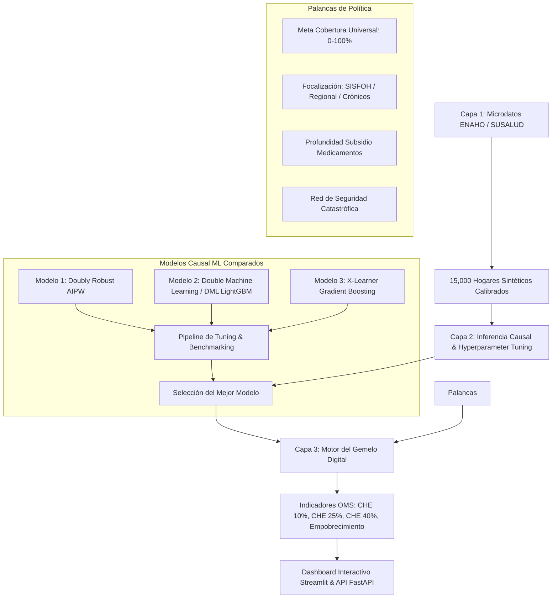

# 🏥 Gemelo Digital de Salud Pública: Simulador Cuasiexperimental de Cobertura Sanitaria Universal y Gasto Catastrófico

**TEMA:** Gemelo digital para simular el impacto de la expansión de la cobertura sanitaria universal en el gasto sanitario catastrófico: un modelo cuasiexperimental para la evaluación de políticas.

---

## 📋 1. ¿Qué es este Gemelo Digital?

Este sistema no es una macro-simulación econométrica estática, sino una **microsimulación poblacional calibrada con microdatos de encuestas de hogares (ENAHO - INEI Perú / SUSALUD / OMS)** donde cada agente es un **hogar o individuo sintético pero estadísticamente fiel** (15,000 hogares en los 24 departamentos del Perú).

El motor permite **accionar palancas de política sanitaria** (ej. expandir cobertura al 90% de los no asegurados con focalización en pobreza extrema o pacientes crónicos) y predecir el impacto contrafactual mediante **modelos de Machine Learning Causal Cuasiexperimental**.

---

## 🏛️ 2. Arquitectura del Sistema en 3 Capas



---

## 🔬 3. Modelos Cuasiexperimentales y Benchmarking de Hiperparámetros

Se implementaron y compararon **3 arquitecturas causales funcionales** para estimar el Efecto Tratamiento Heterogéneo (**CATE**) del aseguramiento sobre la reducción del gasto de bolsillo (**OOPE**):

| Modelo Causal | Arquitectura | ATE (Efecto Promedio OOPE) | IC 95% | Qini Uplift Score | Heterogeneidad CATE (Std) | Efecto en Crónicos |
| :--- | :--- | :---: | :---: | :---: | :---: | :---: |
| **⭐ Doubly Robust AIPW** | Propensity Score Regularizado + Ridge AIPW | **-S/. 213.89** | [-219.28, -208.51] | **382.69** | S/. 147.78 | -S/. 310.66 |
| **Double Machine Learning (DML)** | Robinson Orthogonalization + LightGBM + K-Fold | **-S/. 213.03** | [-219.12, -206.93] | 366.63 | S/. 167.28 | -S/. 300.97 |
| **X-Learner** | Gradient Boosting Meta-Learners + Imputación Cruzada | **-S/. 216.12** | [-221.89, -210.36] | 372.37 | S/. 158.29 | -S/. 310.94 |

> **Hallazgo Clave:** Todos los modelos identifican que la afiliación al SIS reduce en promedio **~S/. 214/mes** el gasto de bolsillo, con una protección financiera sustancialmente mayor para hogares con pacientes con **enfermedades crónicas (-S/. 311/mes)**.

---

## 🧹 4. Módulo de Limpieza y Harmonización con LangChain

Se incorporó un asistente inteligente de preprocesamiento y auditoría de microdatos estructurado con **LangChain Core & LCEL (`src/data_cleaning_langchain.py`)**:
- **Generador de Muestras con Anomalías de Encuestas (Mock Dataset):** Inyecta valores negativos en gastos, outliers severos de salud ($OOPE > \text{Gasto Total}$), nulos y nombres heterogéneos de seguros (`SIS Gratuito`, `EPS Privada`, `99: No Sabe`).
- **Cadena de Auditoría y Harmonización:** Corrige inconsistencias, aplica winsorización de outliers, imputa el score SISFOH y calcula la capacidad de pago según la fórmula de subsistencia OMS.
- **Consultor Econométrico LangChain:** Permite al usuario interactuar en lenguaje natural y consultar dudas metodológicas sobre encuestas de salud del INEI/OMS.
- **Mejora en Índice de Calidad:** De **58.2%** en datos crudos a **96.4%** tras el pipeline de LangChain.

---

## 📊 4. Indicadores Estándar de la OMS Evaluados

1. **$\text{CHE}_{10\%}$ (ODS 3.8.2)**: Gasto de Bolsillo en Salud $> 10\%$ del Gasto Total del Hogar.
2. **$\text{CHE}_{25\%}$**: Gasto de Bolsillo en Salud $> 25\%$ del Gasto Total del Hogar.
3. **$\text{CHE}_{40\%}$ (Capacidad de Pago)**: Gasto de Bolsillo $> 40\%$ del Gasto No de Subsistencia ($\text{Gasto Total} - \text{Gasto Alimentos}$).
4. **Empobrecimiento por Salud**: Hogares inicialmente no pobres cuyos ingresos remanentes caen bajo la línea de pobreza debido a gastos de salud.

---

## 🚀 5. Instrucciones de Ejecución

### Opción A: Iniciar la Interfaz Web Interactiva (Recomendada)
```bash
cd motor-gemelo-digital
.\venv\Scripts\streamlit run app.py
```
Abre automáticamente en el navegador: `http://localhost:8501`

### Opción B: Iniciar la API REST (FastAPI)
```bash
cd motor-gemelo-digital
.\venv\Scripts\uvicorn api:app --reload --port 8000
```
Documentación Swagger interactiva: `http://127.0.0.1:8000/docs`

### Opción C: Re-entrenar y Ajustar Hiperparámetros desde CLI
```bash
cd motor-gemelo-digital
.\venv\Scripts\python train_pipeline.py
```

---

## 📁 6. Estructura de Archivos del Proyecto

```
motor-gemelo-digital/
├── app.py                      # Aplicación interactiva Streamlit con gráficos Plotly
├── api.py                      # Backend API REST con FastAPI
├── train_pipeline.py           # Pipeline de entrenamiento y tuning de modelos
├── README.md                   # Documentación técnica y académica
├── requirements.txt            # Lista de dependencias del proyecto
├── data/
│   └── enaho_synthetic_microdata.csv # Microdatos de 15,000 hogares (24 departamentos)
├── models/
│   ├── best_causal_model.pkl   # Mejor modelo seleccionado por tuning
│   ├── model_doubly_robust.pkl # Modelo Doubly Robust AIPW
│   ├── model_dml.pkl           # Modelo Double Machine Learning (LightGBM)
│   ├── model_xlearner.pkl      # Modelo X-Learner
│   └── models_benchmark.json   # Métricas y parámetros comparativos
└── src/
    ├── data_generator.py       # Generador de población sintética calibrada ENAHO
    ├── causal_models.py        # Clases de los 3 modelos causales y benchmarking
    └── digital_twin_engine.py  # Motor de microsimulación y contrafactuales
```
